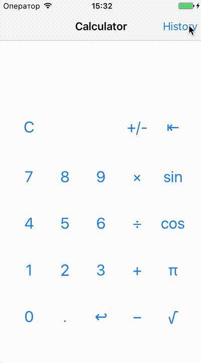

### Assignment #3: The Calculator 2: _Eternal Constraints_
Implement calculator with history similar to the one supplied in binary.

Requirements:
* Use of storyboard files.
* Use of auto layout.
* Correct UI behavior on any device.
* History View showing previous operations
* History persistence between launches
